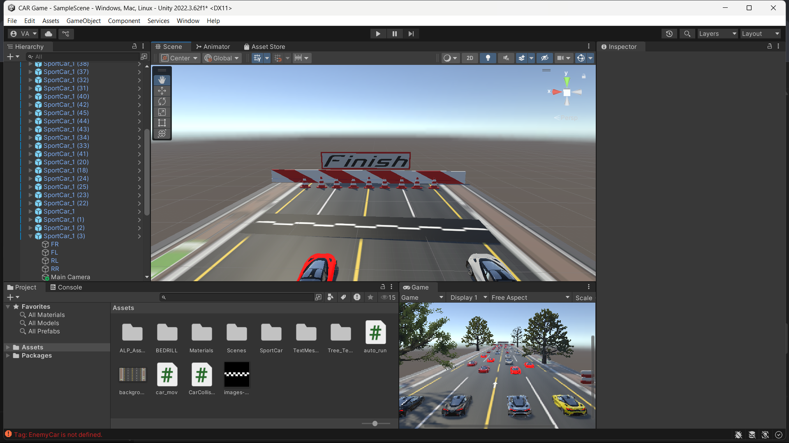
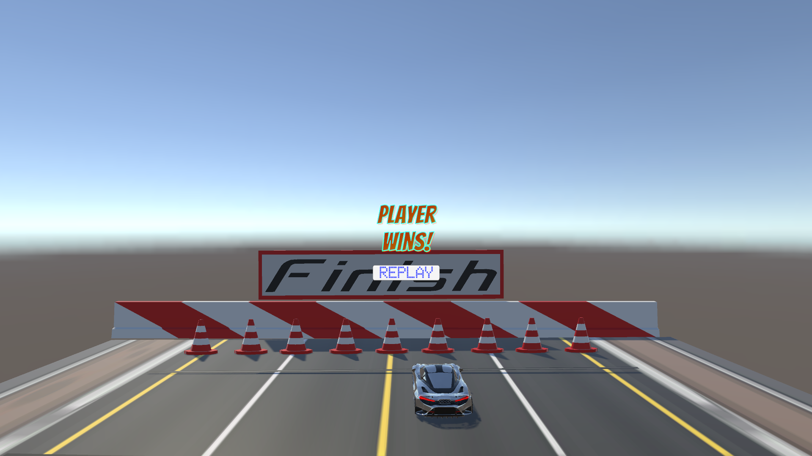

# 🏎️ Unity Car Racing Game

A simple 3D car racing game built in **Unity** 🚗💨  
Includes **Bots**, countdown start, winner announcement, and a replay system!

---

## 🎮 **Features**

- **Player Car Movement** (WASD + Boost with Space)
- **Bot Cars** (Auto-run opponents & traffic cars)
- **Countdown Timer** before race starts
- **Finish Line Detection** (Winner announced automatically)
- **Replay Button** to restart the race

---

## 📂 **Project Structure**

| Folder | Purpose |
|---------|---------|
| `Assets/` | Game assets, scenes, scripts, prefabs |
| `ProjectSettings/` | Unity project settings |
| `Packages/` | Unity package manager data |
| `Build/` | Game's exe file you can double tap to play |

---

## 🚀 **How to Run the Game**

### **Open in Unity**

1️⃣ Open **Unity Hub**  
2️⃣ Click **Add Project**  
3️⃣ Select the downloaded folder (`Unity_Car_Game`)  

---

### **Run the Game**

1️⃣ Open the `SampleScene` (or your racing scene)  
2️⃣ Click the **Play** button in Unity Editor  
3️⃣ Enjoy the race! 🏁

---

## 🎥 **Gameplay Preview**

### 🖼️ **Countdown Start**

---

### 🖼️ **Bot Cars Racing**

---

### 🖼️ **Winner Announcement + Replay**

---

## 🔧 **Controls**

| Key | Action |
|-----|--------|
| **W** | Move Forward |
| **S** | Move Backward |
| **A** | Turn Left |
| **D** | Turn Right |
| **Space** | Boost |

---

## 🛠️ **Built With**

- **Unity 2022 / 2023**  
- **TextMeshPro** for UI  
- **C#** for scripting

---
